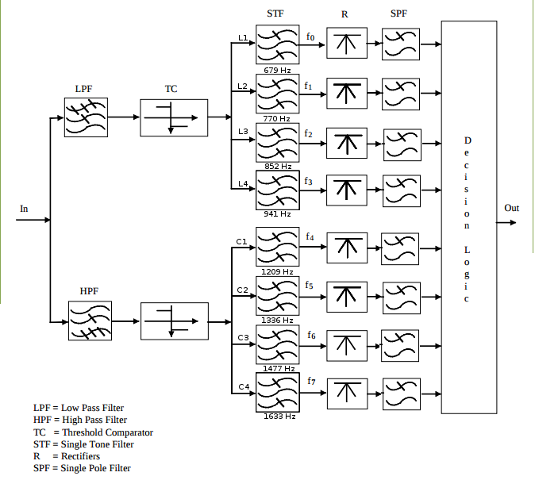

# Projeto_Final_PSD

####   Repositório com o projeto final da disciplina de Processamento de Sinais Digitais do Instituto Federal de Santa Catarina, Campus São José

## Equipe 1: Guilherme Medeiros e Alisson Boeing

* Frequência de amostragem: 44100Hz
* Fator de DownSample: 11
* Frequência de funcionamento: 4009.0909090...

A frequência de amostragem fa2 do sinal de entrada no sistema mostrado abaixo é de 44,1/N kHz, no entanto o sinal gerado no AUDACITY é amostrado em fa1 = 44,1 kHz, portanto antes do circuito abaixo é necessário incluir um filtro antialiasing (low pass) com fc = (44,1/2)/N kHz e um circuito para subamostrar (downsampling) o sinal com fa1 = 44,1 kHz. Esse filtro deverá ser do tipo IIR, sendo de aproximação Butterworth ou Chebyshev tipo 1, para que tenha uma resposta de frequência monotonicamente decrescente após a frequência de corte Assim o sistema terá duas frequências de amostragem, fa1 = 44,1 kHz até o subamostrador e fa2 = 44,1/N kHz depois deste circuito.

## Objetivo: Construir um receptor DTMF como especificado abaixo:
####  As especificações do discriminador de frequência, mostrado na figura, são:

De acordo com [ETSI ES 201 235-3](http://www.etsi.org/deliver/etsi_es/201200_201299/20123503/01.01.01_50/es_20123503v010101m.pdf) - Specification of Dual Tone Multi-Frequency (DTMF) Transmitters and Receivers; Part 3: Receivers as características dos componentes do receptor são:

*— low-pass filter F <= 960 Hz,  no entanto adotaremos a frequência '''sqrt(941*1209)''';

*— high-pass filter F >= 1190 Hz,  no entanto adotaremos a frequência '''sqrt(941*1209)''';

*— two threshold comparators;*

*— eight channel filters (two pole filters: -1,5 dB band pass limits at the nominal frequency ± (1,5%+ 2 Hz));*

*— eight rectifiers;*

*— eight single pole (RC) filters, time constant \tau = 4 a 5 ms.
The thresholds and decision logic are regulated in order not to recognize character signals with a level below -30 dBm
and to recognize valid character signals with a level in the range of -4 dBm to -30 dBm.*

## Especificações do sistema:
* Os filtros das linhas e das colunas devem ser do tipo FIR. As diferenças de atraso entre os filtros devem ser compensadas usados elementos de atraso (z − n)

* Sugere-se utilizar para o filtro do detector de envoltório um filtro IIR do tipo Butterworth.

* O circuito retificador deve se implementado pela função abs.

* O circuito TC - Threshold Comparator não deve ser implementado, pois tem apenas a função de rejeitar sinais de entrada que estão acima de -3dBm ou abaixo de -40 dBm.

#### Como sinais de entrada serão utilizados:
1) Um sinal DTMF gerado através da soma das duas frequência correspondente a linha e coluna.
2) Os 5 Sinal de DTMF correspondentes as 5 teclas indicadas para a equipe, com duração de 0,5 segundos.
3) Um sinal DTMF correspondente a sequencia de teclas "123456789*0#" com duração de tom de 65ms e pausa de 65ms para cada tecla. (ver ETSI ES 201 235-2 - Specification of Dual Tone Multi-Frequency (DTMF) Transmitters and Receivers; Part 2: Transmitters)
4) Os sinais do item (2) e (3) somados a um ruído branco, cuja relação sinal/ruído deve alterável entre 0 dB até 80 dB.
A seleção do sinal de entrada pode ser feita através de manual switch ou multiport switch.

* Os discriminadores das linhas e colunas não especificados, deverão ser feitos usando filtros simples centrados nas frequências centrais das linhas e colunas correspondentes, sem a preocupação de atender as bandas de passagem e rejeição.

* As entradas DTMF deverão deverão gerar valores binário correspondente 1 => 0001 a 9 => 1001, 0 -> 1010, * => 1011, # => 1100.

* Caso nenhuma frequência seja ativada o discriminador deverá indicar um código de "0000" (0); caso seja ativada apenas uma frequência o discriminador deverá indicar um código de ERRO 1 "1101" (13); caso sejam ativados 2 linhas e 1 coluna ou 1 linha e duas colunas o discriminador deverá indicar um código de ERRO 2 "1110" (14); caso contrário o discriminador deverá indicar um código de ERRO 3 "1111" (15);

* Neste projeto os sinais de entrada a serem utilizados deverão ser gerados com frequência de amostragem especificada. Antes de realizar o processamento indicado no diagrama do receptor DTMF, deve ser feita uma filtragem passa-baixa com um filtro de no mínimo 2 polos do tipo Butterworth ou Chebychev 1, com fp = (f_s/2)/N kHz, seguido de uma subamostragem Downsampling de um fator N para a nova frequência f_s2.

* A contante de tempo Τ = RC é equivalente a uma frequência de corte de wc = 1 / (2πΤ)

* Após realizada a simulação do sistema detector DTMF, o sistema deverá ser convertido para VHDL utilizando o HDL coder.

* Para comprovar o funcionamento do sistema realize a simulação final do sistema no ModelSim.

* Eliminar oscilações com uma hesteresis.

### **Avaliação:**

1) Implementação do Sistema,
2) Documentação,
3) Avaliação Global do aluno no projeto.

## Documentação da realização:

* Foram encontrados áudios com os sinais DTMF em [fonte DTMF](https://evolution.voxeo.com/library/audio/prompts/dtmf/index.jsp). Estes áudios serão usados como entrada no sistema.
* Foi utilizado um canal AWGN com SNR = 5 definido por:
>   SNR = Eb/N0.
* As entradas DTMF são definidas por um conjunto de seletores.
* Foi feito um filtro na metade da frequência pós downsample para eliminar efeito de aliasing:
> FreqFilt = 4009.0909090/2 = 2004.5454545Hz
* Foi feito um filtro butterworth passa baixa de ordem 2 na transmissão dos tons DTMF. A frequência de corte foi a de 44100/2/N, sendo N o fator de *downsample* = 11, resultando em 2004.545454Hz, arredondado para 2005Hz. Além disso foi feito o bloco do *downsample*.

* É necessário separar as frequẽncias altas de frequências baixas. Isto foi feito com o uso de dois filtros IIR butterworth:
> * Um filtro lowpass com frequência de corte em 1066.615Hz de ordem 2.
> * Um filtro highpass com frequência de corte em 1066.615Hz de ordem 4.

* Para os filtros passa faixa, foi feito uma tabela com as frequências utilizadas:

